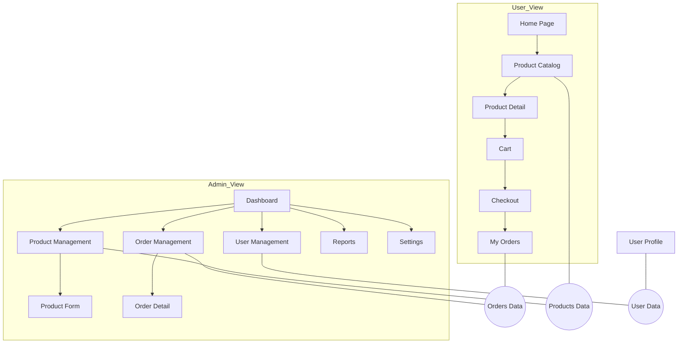

Để tổ chức và kết hợp các component React sao cho mượt mà, dễ bảo trì và hiệu năng tốt, bạn có thể tham khảo các nguyên tắc sau:

---

## 1. Xây dựng kiến trúc component rõ ràng

1. **Atomic Design**  
   - **Atoms**: nút bấm, input, label…  
   - **Molecules**: sự kết hợp nhỏ (ví dụ form-field = label + input)  
   - **Organisms**: section hoàn chỉnh (ví dụ navbar, card list)  
   - **Templates & Pages**: bố cục trang, data kết hợp các organisms  

2. **Container vs Presentational**  
   - **Presentational Component** chỉ lo về UI, nhận data qua props và callback event.  
   - **Container Component** lo lấy data (API, context, Redux), xử lý business logic, truyền xuống Presentational.

---

## 2. Quản lý state tập trung hợp lý

1. **Local state** với `useState`, `useReducer` cho state nhỏ, cục bộ  
2. **Context API** cho sharing data xuyên cây component (theme, auth, ngôn ngữ)  
3. **Redux / Zustand / MobX** cho ứng dụng lớn, state phức tạp, nhiều luồng update  
4. **React Query / SWR** cho data-fetching: cache, cập nhật realtime, retry, pagination  

> ⚠️ Tránh “prop drilling” (truyền props sâu nhiều tầng) bằng cách nâng state lên mức cao hơn hoặc dùng Context.

---

## 3. Tối ưu hiệu năng rendering

1. **React.memo**  
   - Bọc component để chỉ rerender khi props thực sự thay đổi.  
   ```js
   const Button = React.memo(({ onClick, children }) => { … })
   ```

2. **useCallback / useMemo**  
   - `useCallback` giữ nguyên tham chiếu hàm giữa các lần render tránh rerender con nhận callback.  
   - `useMemo` cache kết quả tính toán nặng, chỉ tính lại khi dependencies đổi.

3. **Code-splitting và Lazy loading**  
   ```js
   const HeavyChart = React.lazy(() => import('./HeavyChart'))
   <Suspense fallback={<Spinner/>}>
     <HeavyChart data={…}/>
   </Suspense>
   ```

4. **Windowing / Virtualization**  
   Dùng `react-window` hoặc `react-virtualized` cho danh sách dài, table lớn.

---

## 4. Composition (Ghép nối) component

1. **Children Prop**  
   Cho phép “nhét” UI con vào bố cục chung:
   ```jsx
   function Card({ title, children }) {
     return (
       <div className="card">
         <h3>{title}</h3>
         <div className="card-body">{children}</div>
       </div>
     )
   }
   ```
2. **Render Props**  
   Truyền hàm để render động:
   ```jsx
   <DataFetcher url="/api/items">
     {({ data, loading }) =>
       loading ? <Spinner/> : <List items={data}/>
     }
   </DataFetcher>
   ```
3. **Custom Hooks**  
   Tách logic tái sử dụng (fetch data, form handling, pagination…) ra hook:
   ```js
   function useFetch(url) {
     const [data, setData] = useState(null)
     useEffect(() => { fetch(url).then(r => r.json()).then(setData) }, [url])
     return data
   }
   ```

---

## 5. Styling và theme

1. **CSS Modules / SASS**: tránh xung đột class  
2. **CSS-in-JS** (styled-components, Emotion): style dynamic, theme dễ quản lý  
3. **Utility-first** (Tailwind CSS): tăng tốc dev, giảm CSS dư thừa  

---

## 6. Kiểm thử và phát triển song song

1. **Storybook**: xây dựng và test UI component riêng biệt  
2. **RTL + Jest**: unit-test và integration-test component  
3. **Cypress / Playwright**: end-to-end test flow người dùng  

---

### Tóm lại

- **Phân tách rõ trách nhiệm** (UI vs logic)  
- **Quản lý state** hợp lý, tránh prop drilling  
- **Tối ưu** rerender với memo, lazy loading, virtualization  
- **Reuse** với composition (children, render props, custom hooks)  
- **Styling** có framework/kiến trúc rõ ràng  

Nếu bạn áp dụng nhất quán, ứng dụng React sẽ vừa rõ ràng, dễ bảo trì lại cho trải nghiệm mượt mà, phản hồi nhanh. Chúc bạn thành công!

Dưới đây là một breakdown các UI component chính cho hai luồng Admin và User, cùng sơ đồ luồng (flowchart) minh họa cách “kết hợp danh sách” (ví dụ: danh sách sản phẩm, đơn hàng, người dùng…) giữa hai vai trò.

---

## 1. Danh mục Component

| Vai trò | Trang/Module             | Component chính                            | Chức năng                                   |
|---------|--------------------------|---------------------------------------------|---------------------------------------------|
| **Admin** | Dashboard               | `AdminDashboard`                            | Tổng quan (cards số liệu thống kê)          |
|         | Quản lý sản phẩm         | `ProductList`, `ProductCard`, `ProductForm` | Xem, tạo, sửa, xóa sản phẩm                |
|         | Quản lý đơn hàng         | `OrderList`, `OrderDetailModal`             | Xem trạng thái, xử lý đơn                   |
|         | Quản lý khách hàng       | `UserList`, `UserProfileModal`              | Xem/Sửa thông tin user                      |
|         | Báo cáo & Thống kê       | `ReportFilter`, `ChartContainer`            | Lọc khoảng thời gian, hiển thị chart         |
|         | Cài đặt (Settings)       | `SettingsMenu`, `SettingsForm`              | Cấu hình hệ thống                           |
| **User**  | Home                   | `UserHomeBanner`, `RecommendedList`         | Hiển thị banner, gợi ý                      |
|         | Danh sách sản phẩm       | `ProductCatalog`, `ProductItem`             | Lọc/sắp xếp, add-to-cart                   |
|         | Chi tiết sản phẩm        | `ProductDetail`, `AddToCartButton`          | Xem ảnh, mô tả, thêm vào giỏ               |
|         | Giỏ hàng (Cart)          | `CartItemList`, `CartSummary`, `CheckoutBtn`| Xem, chỉnh số lượng, tiến hành thanh toán  |
|         | Đơn hàng của tôi          | `MyOrdersList`, `OrderCardUser`             | Xem lịch sử, trạng thái đơn                |
|         | Thông tin tài khoản      | `ProfileForm`, `AddressBook`                | Sửa thông tin cá nhân, địa chỉ             |

---

## 2. Sơ đồ luồng danh sách kết hợp (Mermaid)



- **SharedProducts**: toàn bộ dữ liệu products được dùng chung giữa hai luồng (`Product Catalog` của User và `Product Management` của Admin).  
- **SharedOrders**: dữ liệu đơn hàng dùng chung (`My Orders` của User vs `Order Management` của Admin).  
- **SharedUsers**: Admin xem/chỉnh user, User xem hồ sơ cá nhân.  

---

### Hướng dẫn sử dụng sơ đồ

1. **Gộp dữ liệu chung** (Shared Data):  
   - Sản phẩm, Đơn hàng, Thông tin người dùng được expose qua API chung.  
2. **Phân quyền hiển thị**:  
   - Client React dựa vào role từ Auth Context / JWT Decoded để điều hướng và ẩn/hiện component tương ứng (ví dụ: chỉ hiện `OrderDetail` modal khi role = Admin).  
3. **Luồng điều hướng**:  
   - Dùng React Router để định tuyến (`/admin/products`, `/user/cart`, v.v.).  
4. **Tách biệt UI vs Logic**:  
   - Container components (ví dụ `ProductContainer`) fetch API, truyền data xuống presentational components (`ProductList`, `ProductItem`).  
5. **Kết hợp chung**:  
   - Tạo các custom hook như `useProducts()`, `useOrders()` để cả hai luồng (Admin/User) cùng tái sử dụng.  

Bạn có thể copy đoạn Mermaid trên vào bất kỳ công cụ hỗ trợ (VS Code với extension “Markdown Preview Mermaid”, hoặc trang web [Mermaid Live Editor](https://mermaid-js.github.io/mermaid-live-editor/)) để vẽ sơ đồ flow interactive. Chúc bạn triển khai mượt mà!


Dưới đây là danh sách chi tiết **tất cả các UI component** kèm **đường dẫn (route)** tương ứng cho cả hai vai trò Admin và User, cùng **sơ đồ Mermaid** minh họa flow giữa chúng, và hướng dẫn cách dùng sơ đồ.

---

## 1. Bảng tổng hợp Component và Route

| Vai trò   | Module / Page               | Route                       | Container Component      | Presentational Component(s)                         | Mô tả chức năng                                                 |
|-----------|-----------------------------|-----------------------------|--------------------------|------------------------------------------------------|-----------------------------------------------------------------|
| **User**  | Home                        | `/`                         | `HomeContainer`         | `HomeBanner`, `RecommendedList`                      | Trang chủ, banner và danh sách gợi ý                            |
|           | Product Catalog             | `/products`                 | `ProductCatalogContainer`| `ProductList`, `ProductItem`, `ProductFilters`       | Danh sách sản phẩm với filter/sort                              |
|           | Product Detail              | `/products/:id`             | `ProductDetailContainer` | `ProductDetail`, `AddToCartButton`, `ImageCarousel`  | Chi tiết sản phẩm, thêm vào giỏ                                 |
|           | Cart                        | `/cart`                     | `CartContainer`         | `CartItemList`, `CartSummary`, `CartActions`         | Giỏ hàng, chỉnh sửa số lượng, xóa item                          |
|           | Checkout                    | `/checkout`                 | `CheckoutContainer`     | `CheckoutForm`, `PaymentMethods`, `OrderReview`      | Thông tin giao hàng, chọn phương thức thanh toán                |
|           | My Orders                   | `/orders`                   | `MyOrdersContainer`     | `OrderCardUser`, `OrderList`                         | Lịch sử đơn hàng của user                                       |
|           | Profile                     | `/profile`                  | `ProfileContainer`      | `ProfileForm`, `AddressBook`                         | Xem/sửa thông tin cá nhân và địa chỉ                            |
| **Admin** | Dashboard                   | `/admin`                    | `AdminDashboardContainer`| `StatsCard`, `QuickActions`                          | Tổng quan (sản phẩm, đơn hàng, doanh thu…)                      |
|           | Product Management          | `/admin/products`           | `ProductMgmtContainer`  | `ProductListAdmin`, `ProductCardAdmin`               | Xem/sửa/xóa sản phẩm                                            |
|           | Product Form (Add/Edit)     | `/admin/products/new`<br>`/admin/products/:id/edit` | `ProductFormContainer`  | `ProductForm`                                         | Form thêm hoặc chỉnh sửa sản phẩm                               |
|           | Order Management            | `/admin/orders`             | `OrderMgmtContainer`    | `OrderListAdmin`, `OrderCardAdmin`                   | Xem và xử lý đơn hàng                                           |
|           | Order Detail                | `/admin/orders/:id`         | `OrderDetailContainer`  | `OrderDetail`, `OrderStatusActions`                  | Chi tiết đơn hàng, thay đổi trạng thái                          |
|           | User Management             | `/admin/users`              | `UserMgmtContainer`     | `UserListAdmin`, `UserCardAdmin`                     | Danh sách và thao tác với user                                  |
|           | Reports & Analytics         | `/admin/reports`            | `ReportContainer`       | `ReportFilter`, `ChartDashboard`                     | Lọc và xem biểu đồ thống kê                                     |
|           | Settings                     | `/admin/settings`           | `SettingsContainer`     | `SettingsMenu`, `SettingsForm`                       | Cấu hình chung của hệ thống                                     |

---

## 2. Sơ đồ Mermaid có gắn Route

```mermaid
flowchart TD
  %% User Flow
  subgraph User_View
    U1[/Home<br/>(/)] --> U2[/Products<br/>(/products)]
    U2 --> U3[/Product Detail<br/>(/products/:id)]
    U3 --> C[/Cart<br/>(/cart)]
    C --> CO[/Checkout<br/>(/checkout)]
    CO --> U4[/My Orders<br/>(/orders)]
    U1 --> U5[/Profile<br/>(/profile)]
  end

  %% Admin Flow
  subgraph Admin_View
    A1[/Dashboard<br/>(/admin)] --> A2[/Products Mgmt<br/>(/admin/products)]
    A2 --> A3[/Product Form<br/>(/admin/products/new<br/>/admin/products/:id/edit)]
    A1 --> A4[/Orders Mgmt<br/>(/admin/orders)]
    A4 --> A5[/Order Detail<br/>(/admin/orders/:id)]
    A1 --> A6[/Users Mgmt<br/>(/admin/users)]
    A1 --> A7[/Reports<br/>(/admin/reports)]
    A1 --> A8[/Settings<br/>(/admin/settings)]
  end

  %% Shared Data Connections
  U2 --- SharedProducts((Products Data))
  A2 --- SharedProducts

  U4 --- SharedOrders((Orders Data))
  A4 --- SharedOrders

  U5 --- SharedUsers((User Data))
  A6 --- SharedUsers
```

- Các ô `[/Label<br/>(route)]` dùng cú pháp Mermaid để hiển thị tên + đường dẫn.  
- Các mối liên kết `--- SharedXXX` thể hiện sharing data qua cùng một API/backend.

---

## 3. Hướng dẫn sử dụng sơ đồ

1. **Copy & Paste** đoạn code Mermaid trên vào:  
   - VS Code (với extension “Markdown Preview Mermaid”).  
   - [Mermaid Live Editor](https://mermaid-js.github.io/mermaid-live-editor/).  
2. **Tùy chỉnh** nếu bạn có thêm module mới hoặc muốn đổi route.  
3. **Theo dõi flow**:  
   - Khi user click link, React Router sẽ match route → render đúng container component → presentational component.  
   - Dữ liệu chung được fetch qua custom hooks (`useProducts`, `useOrders`, `useUsers`) và truyền vào cả luồng User/ Admin.  
4. **Phân quyền**:  
   - Trong `App.js` trước khi render route, kiểm tra role (từ Context/JWT).  
   - Nếu user không có quyền, redirect về `/` hoặc trang 403.  
5. **Tách tường lửa UI**:  
   - Để tránh component Admin bị load trong UI User, gom tất cả route `/admin/*` vào một `AdminLayout` riêng, dùng `<ProtectedRoute>` wrapper.

---

Với bảng chi tiết + sơ đồ này, bạn có thể dễ dàng hình dung và triển khai toàn bộ UI component, đường dẫn, và luồng sử dụng giữa Admin và User một cách rõ ràng, mượt mà. Chúc bạn coding hiệu quả!


Dưới đây mình bổ sung thêm các **chức năng phân tích dữ liệu (Data Analytics & Machine Learning)** vào luồng Admin, và cập nhật lại sơ đồ kết hợp với các module học máy:

---

## 1. Bảng tổng hợp Admin Component kèm Data Analytics & ML

| Module / Page              | Route                     | Container Component        | Presentational Component(s)                    | Mô tả chức năng                                                                                       |
|----------------------------|---------------------------|----------------------------|-------------------------------------------------|-------------------------------------------------------------------------------------------------------|
| **Dashboard**              | `/admin`                  | `AdminDashboardContainer`  | `StatsCard`, `QuickActions`                     | Các chỉ số tổng quan                                                                                  |
| **Product Management**     | `/admin/products`         | `ProductMgmtContainer`     | `ProductListAdmin`, `ProductCardAdmin`          | Quản lý sản phẩm                                                                                      |
| **Product Form**           | `/admin/products/new`     | `ProductFormContainer`     | `ProductForm`                                   | Thêm/Sửa sản phẩm                                                                                     |
| **Order Management**       | `/admin/orders`           | `OrderMgmtContainer`       | `OrderListAdmin`, `OrderCardAdmin`              | Quản lý đơn hàng                                                                                      |
| **Order Detail**           | `/admin/orders/:id`       | `OrderDetailContainer`     | `OrderDetail`, `OrderStatusActions`             | Chi tiết & xử lý đơn                                                                                  |
| **User Management**        | `/admin/users`            | `UserMgmtContainer`        | `UserListAdmin`, `UserCardAdmin`                | Quản lý user                                                                                          |
| **Reports & Analytics**    | `/admin/reports`          | `ReportContainer`          | `ReportFilter`, `ChartDashboard`                | Thống kê & biểu đồ cơ bản                                                                             |
| **Settings**               | `/admin/settings`         | `SettingsContainer`        | `SettingsMenu`, `SettingsForm`                  | Cấu hình hệ thống                                                                                     |
| **Data Analytics**         | `/admin/analytics`        | `AnalyticsContainer`       | `DataTable`, `PivotTable`, `FilterPanel`        | Cho phép xem/ lọc/ drill-down dữ liệu thô                                                             |
| **ML Model Training**      | `/admin/ml/train`         | `MLTrainContainer`         | `TrainForm`, `HyperparamPanel`, `TrainLog`      | Chọn dataset, thuật toán, hyperparam, khởi chạy huấn luyện                                            |
| **ML Model Evaluation**    | `/admin/ml/evaluate`      | `MLEvaluateContainer`      | `EvalMetricsTable`, `ConfusionMatrix`, `ROCChart` | Hiển thị kết quả eval (accuracy, F1, confusion matrix, ROC)                                           |
| **ML Predictions**         | `/admin/ml/predict`       | `MLPredictContainer`       | `PredictForm`, `PredictionResultsTable`         | Nhập input mẫu, chạy inference và hiển thị kết quả dự đoán                                            |
| **Model Management**       | `/admin/ml/models`        | `ModelMgmtContainer`       | `ModelList`, `ModelDetail`, `DeployToggle`      | Quản lý các model đã train, xem version, deploy/undeploy                                              |

---

## 2. Sơ đồ Mermaid cập nhật với các module ML & Analytics

```mermaid
flowchart TD
  %% Admin Flow
  subgraph Admin_View
    A1[/Dashboard<br/>(/admin)] --> A2[/Products Mgmt<br/>(/admin/products)]
    A2 --> A3[/Product Form<br/>(/admin/products/new<br/>/admin/products/:id/edit)]
    A1 --> A4[/Orders Mgmt<br/>(/admin/orders)]
    A4 --> A5[/Order Detail<br/>(/admin/orders/:id)]
    A1 --> A6[/Users Mgmt<br/>(/admin/users)]
    A1 --> A7[/Reports<br/>(/admin/reports)]
    A1 --> A8[/Settings<br/>(/admin/settings)]
    A1 --> B1[/Data Analytics<br/>(/admin/analytics)]
    B1 --> B2[/ML Training<br/>(/admin/ml/train)]
    B1 --> B3[/ML Evaluation<br/>(/admin/ml/evaluate)]
    B1 --> B4[/ML Predictions<br/>(/admin/ml/predict)]
    B1 --> B5[/Model Mgmt<br/>(/admin/ml/models)]
  end

  %% Shared Data Connections
  A2 --- SharedProducts((Products Data))
  A4 --- SharedOrders((Orders Data))
  A6 --- SharedUsers((User Data))
  B1 --- SharedAnalytics((Raw & Aggregated Data))
  B2 --- SharedAnalytics
  B3 --- SharedAnalytics
  B4 --- SharedAnalytics
  B5 --- SharedAnalytics
```

- **Data Analytics (`/admin/analytics`)**: trung tâm để fetch mọi data thô và aggregated từ backend (ví dụ logs, transactions).  
- **ML Training/Evaluation/Predictions**: đều kết nối tới cùng **SharedAnalytics**—backend sẽ cung cấp dataset cho huấn luyện, kết quả đánh giá và inference.  
- **Model Management**: quản lý version và trạng thái deploy.  

---

## 3. Hướng dẫn tích hợp

1. **Backend API**  
   - Mở rộng API: endpoints cho analytics (`/api/admin/analytics`), ML (`/api/admin/ml/train`, `/evaluate`, `/predict`, `/models`).  
   - Dữ liệu huấn luyện: có thể từ từng module (orders, products, users) hoặc từ data warehouse.  

2. **Frontend**  
   - Tạo các custom hook tái sử dụng:  
     - `useAnalytics(filters)`, `useMLTrain(params)`, `useMLEvaluate(modelId)`, `useMLPredict(modelId, payload)`, `useModels()`.  
   - Container components gọi hook, quản lý loading/error.  
   - Presentational components hiển thị table, chart (ví dụ Recharts hoặc Chart.js).  

3. **Quy trình ML**  
   - **Training**: form chọn thuật toán (RandomForest, XGBoost, LSTM…), hyperparam, bắt đầu job.  
   - **Evaluation**: hiển thị metrics (accuracy, precision/recall/F1), confusion matrix, ROC curve.  
   - **Deployment**: admin có thể deploy model vào production thông qua nút toggle.  

4. **UX/UI**  
   - Dùng **Tabs** hoặc **Sidebar** để điều hướng giữa Analytics, ML Training, ML Evaluate, ML Predict, Model Mgmt.  
   - **FilterPanel** ở Analytics cho phép drill-down (date range, category, user segment).  
   - **Live logs** ở TrainingLog để xem tiến trình training real-time (websocket).  

---

Với sơ đồ và danh sách component này, bạn có thể mở rộng Admin panel thành một “AI Ops Dashboard” đầy đủ: từ thống kê cơ bản đến huấn luyện và triển khai mô hình học máy. Chúc bạn thành công!